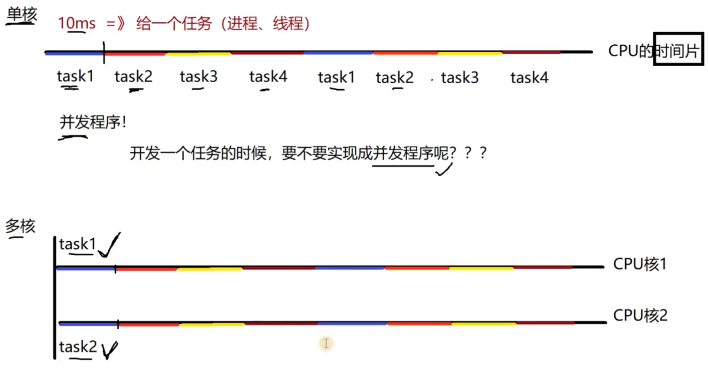
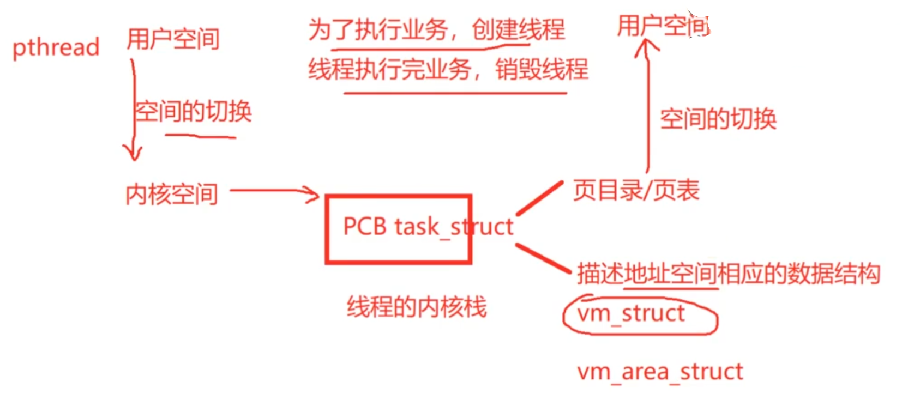
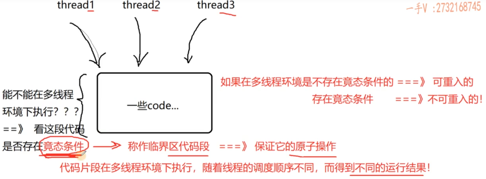
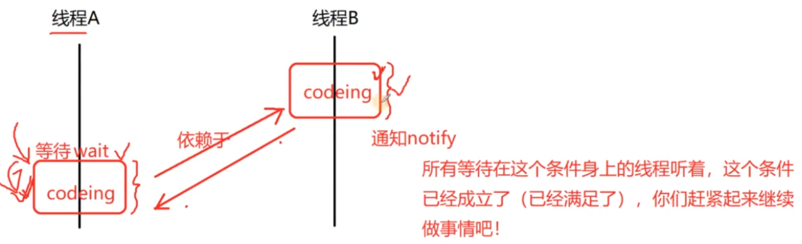
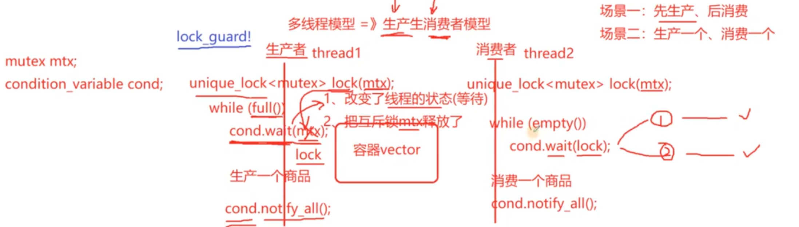
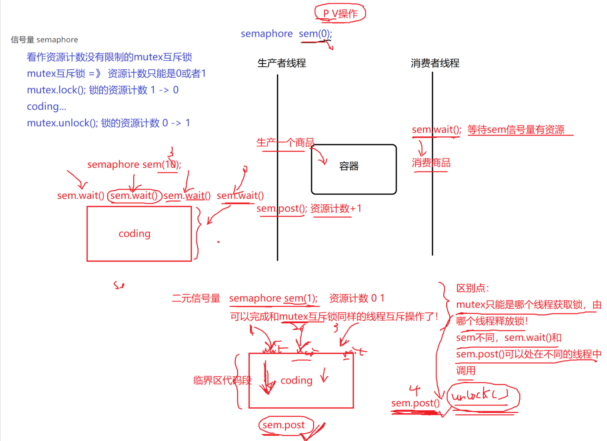
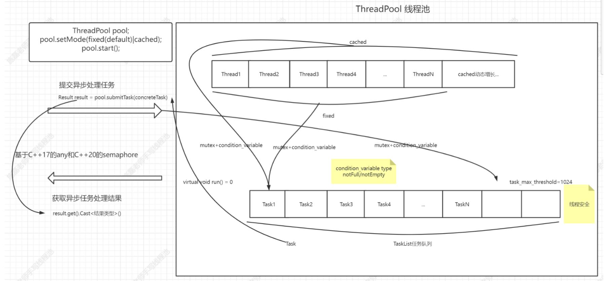

# Thread Pool

## 项目介绍

跨平台多线程项目

## 知识背景

1. 熟练C++ 11标准的面向对象编程

   组合 继承 多态 STL 智能指针 函数对象 绑定器 可变参数模板编程等
2. 熟悉C++11多线程编程

   Thread mutex atomic condition_variable uinque_lock 等
3. C++ 17 和 C++ 20标准的内容

   C++ 17的any类型和C++20的信号量seamphore，（自己实现）
4. 熟悉多线程理论

   多线程基本知识 线程互斥 线程同步原子操作 CAS

## 并发和并行

CPU 单核、多核多CPU

### 并发

单核上，多个线程占用不同的CPU时间片，物理上还是串行执行的，但是由于每个线程占用的CPU时间片非常短（比如10ms），看起来就像是多个线程都在共同执行一样，这样的场景称作并发（concurrent）。

### 并行

在多核或者多CPU上，多个线程是在真正的同时执行，这样的场景称作并行（parallel）。

单核： **IO 密集型的程序也是适合的 CPU密集型的程序不适合**（线程的调度有额外的花费）

多核：一部分CPU密集型的任务  一部分IO密集型的人物

## 多线程的优势

多线程一定好吗？

答：不一定，要看具体的应用场景

### IO密集型

程序里面指令的执行，涉及一些IO操作，比如设备、文件、网络操作（等待客户端的连接 **IO 的操作是可以把程序阻塞住的** : 重点）

更加适合设计成多线程程序的

### CPU密集型

程序里面的指令都是做计算用的

## 线程池

### 线程池的消耗

为了完成任务，创建很多的线程可以吗？线程真的是越多越好吗？

* 线程的创建和销毁都是非常**重**的操作   （在服务执行的过程中去实时的创建和销毁过程）

  
* 线程栈本身占用大量内存   （一个栈8 MB 用户空间大约3 GB 一个进程最多创建约380个线程，每一个线程都需要线程栈，栈都被用完了，没法做事情）
* 线程的上下文切换要占用大量时间  （线程过多，线程的调度是需要进行上下文切换的，切换花费的 CPU 时间特别多， CPU 的利用率就不高了）
* 大量的线程同时唤醒会使系统经常出现锯齿状负载或瞬间负载量很大导致宕机）

多少线程数量好呢？
IO 复用 + 多线程 （有几个线程的呢？ 一般是按照当前 CPU 核心数量来确定的）

## 线程池

### 线程池的优势

**操作系统上创建线程和销毁线程都是很"重"的操作，耗时耗性能都比较多，那么在服务执行的过程中，如果业务量比较大，实时的去创建线程、执行业务、业务完成后销毁线程，那么会导致系统的实时性能降低，业务的处理能力也会降低。**

**线程池的优势就是（每个池都有自己的优势），在服务进程启动之初，就事先创建好线程池里面的线程，当业务流量到来时需要分配线程，直接从线程池中获取一个空闲线程执行 task 任务即可， task 执行完成后，也不用释放线程，而是把线程归还到线程池中继续给后续的 task 提供服务。**

#### Fixed 模式线程池

线程池里面的线程个数是固定不变的，一般是Thread Pool创建时根据当前机器的CPU核心数量进行指定。

#### cached 模式线程池

线程池里面的线程个数是可动态增长的，根据任务的数量动态的增加线程的数量，但是会设置一个线程数量的阈值（线程过多的坏处上面已经讲过了），任务处理完成，如果动态增长的线程空闲了60s还没有处理其它任务，那么关闭线程，保持池中最初数量的线程即可。

## 线程同步

线程互斥 mutex CAS atomic

线程通信 条件变量 + 信号量

### 线程互斥

* 互斥锁 mutex
* 原子类型 atomic

> [!TIP]
>
> *CAS 操作（无锁机制）*
>
> *lock trylock lock_guard unique_lock*

> [!NOTE]
>
> 1. 竞态条件：指多个线程以**不可预测的顺序**访问共享资源，导致程序的**最终结果依赖于线程调度的时序**。这是一种**bug**，不是正常行为。
> 2. 临界区：指一段**访问共享资源的代码**（**存在竟态条件的代码段称为临界区代码段**），这段代码**在同一时间只能被一个线程执行**。如果多个线程同时进入，就会导致数据不一致。
> 3. 原子操作：是指一个操作**不可分割**，要么完全执行，要么完全不执行，**不会被线程调度机制打断**。（临界区代码段需要保证它的原子操作）
> 4. 一个函数是可重入的，如果同一个线程可以安全地再次进入它（**多线程环境下是不存在竟态条件的称为可重入的，存在竟态条件：不可重入**）

### 线程通信

* 条件变量condition_variable

  cond.wait(lock)  1. 改变线程状态 2. 把互斥锁mtx释放掉

  linux 系统pthread

  C++11 thread

  mutex + condition_variable 需要传入一个互斥锁

  **C++ STL都没有考虑线程安全**

  例子：多线程模型=》生产者消费者模型

  
* 信号量 semaphore (C++20)

  可以看作资源计数没有限制的mutex互斥锁

  mutex互斥锁=》资源计数只能是0或者1

  mutex.lock(); 锁的资源计数1->0

  coding...

  mutex.unlock();锁的资源计数0->1

区别点：

* mutex只能是哪个线程获取锁，由哪个线程释放锁
* sem不同，sem.wait()和sem.post()可以处在不同的线程中调用

## 项目设计

## 问题

1. 怎么设计run函数的返回值，可以表示任意的类型 any
2. 如何设计这里的Result机制

基于前面的C++的基础知识，怎么构建一个Any类型

​	任意的其他类型 template

​	能让一个类型指向其他任意类型  基类 => 派生类

cache 缓存
